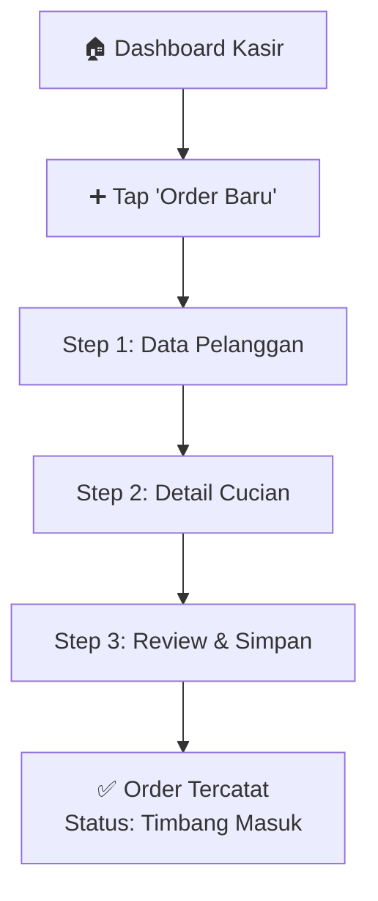
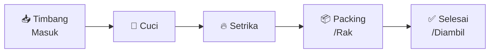
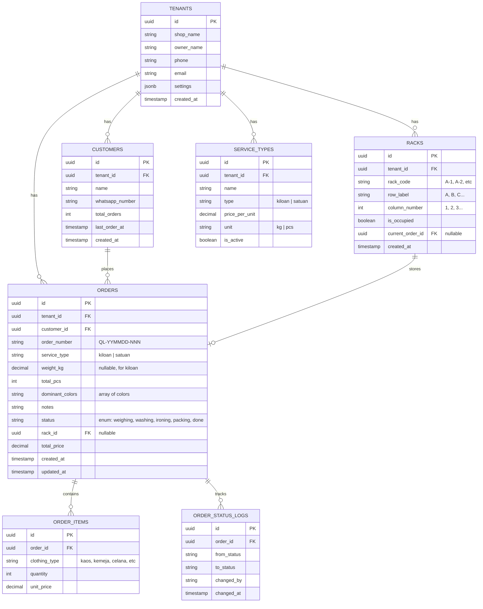
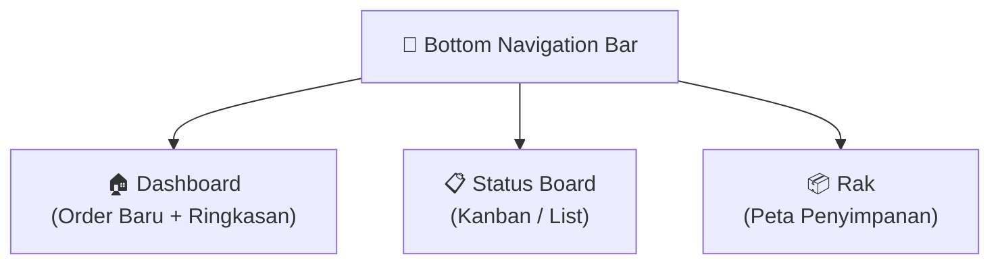

# 📋 PRD: Queen Laundry — Micro-SaaS Manajemen Operasional UMKM Laundry

**Versi:** 1.0  
**Tanggal:** 24 Maret 2026  
**Status:** Draft — Menunggu Review

---

## 1. Ringkasan Eksekutif

Queen Laundry adalah aplikasi web Micro-SaaS yang dirancang untuk mendigitalkan operasional UMKM laundry kiloan & satuan di Indonesia. MVP ini berfokus pada **satu alur kritis**: pencatatan order masuk dan pelacakan status cucian secara real-time, dengan UX yang dioptimalkan untuk input cepat di perangkat layar sentuh (tablet/smartphone).

### Problem Statement

| Problem | Dampak |
|---|---|
| Nota kertas lambat & rawan hilang | Order terlewat, data tidak akurat |
| Pakaian tertukar / hilang | Kerugian finansial, kehilangan pelanggan |
| Tidak ada tracking status | Pelanggan komplain, jadwal molor |
| Karyawan bingung posisi barang | Waktu terbuang mencari pakaian |

### Solution

Sistem digital dengan:
- **Input order < 30 detik** via tombol sentuh (zero keyboard typing untuk data utama)
- **Kanban board** visual untuk tracking status cucian
- **Sistem rak** untuk pencegahan barang hilang
- **Arsitektur multi-tenant** untuk skalabilitas SaaS

---

## 2. Target Pengguna & Persona

### Persona 1: Pak Budi — Pemilik Laundry
- **Umur:** 35-50 tahun
- **Tech Literacy:** Rendah-Menengah (WhatsApp, Facebook)
- **Kebutuhan:** Melihat ringkasan operasional, jumlah order, pendapatan harian
- **Device:** Smartphone Android (layar 6")

### Persona 2: Sari — Kasir / Operator
- **Umur:** 20-30 tahun
- **Tech Literacy:** Menengah (terbiasa aplikasi mobile)
- **Kebutuhan:** Input order cepat, update status cucian, cari posisi rak
- **Device:** Tablet Android (layar 8-10") di meja kasir
- **Kondisi Kerja:** Tangan sering basah/kotor, ruangan terang, sibuk

---

## 3. Scope MVP

### ✅ Dalam Scope (MVP)

| Fitur | Prioritas |
|---|---|
| Dashboard Kasir — Form Input Order Cepat | P0 (Kritis) |
| Kanban Board — Tracking Status Cucian | P0 (Kritis) |
| Manajemen Rak / Penyimpanan | P0 (Kritis) |
| Daftar Order & Pencarian | P1 (Penting) |
| Ringkasan Harian (jumlah order, total kg) | P1 (Penting) |

### ❌ Di Luar Scope (Versi Selanjutnya)

- Notifikasi WhatsApp otomatis
- Sistem pembayaran / kasir (POS)
- Laporan keuangan & analitik lanjutan
- Login multi-user & RBAC (Role Based Access Control)
- Cetak struk / barcode
- Integrasi payment gateway

---

## 4. Spesifikasi Fitur Detail

### 4.1 Dashboard Kasir — Input Order Baru

> [!IMPORTANT]
> UX Goal: Kasir bisa menyelesaikan input 1 order dalam **< 30 detik** tanpa keyboard fisik.

#### 4.1.1 Alur Input Order



#### 4.1.2 Step 1 — Data Pelanggan

| Field | Tipe Input | Keterangan |
|---|---|---|
| Nama Pelanggan | Text input + autocomplete | Autocomplete dari database pelanggan existing |
| No. WhatsApp | Number input | Format +62xxx, auto-format |

- **Autocomplete**: Saat kasir mengetik 3 huruf pertama, sistem menampilkan suggestion pelanggan yang pernah order sebelumnya (nama + no. WA)
- Jika pelanggan baru, input manual dan otomatis tersimpan

#### 4.1.3 Step 2 — Detail Cucian

**Jenis Layanan** — Toggle Button (pilih salah satu):

```
┌─────────────┐  ┌─────────────┐
│  ⚖️ KILOAN  │  │  👔 SATUAN  │
│  Rp 7.000/kg│  │  Per Item    │
└─────────────┘  └─────────────┘
```

**Jika KILOAN:**

| Field | Tipe Input |
|---|---|
| Berat (Kg) | Number stepper dengan tombol +/- (increment 0.1 kg) |
| Estimasi Jumlah (Pcs) | Number stepper dengan tombol +/- |

**Jika SATUAN:**

| Field | Tipe Input |
|---|---|
| Jenis Pakaian | Grid chips (multi-select + jumlah per item) |

**Jenis Pakaian** — Grid Chips (multi-select):

```
┌────────┐ ┌────────┐ ┌────────┐ ┌────────┐
│ 👕 Kaos│ │👔Kemeja│ │👖Celana│ │🛏️ Sprei│
│   ×0   │ │   ×0   │ │   ×0   │ │   ×0   │
└────────┘ └────────┘ └────────┘ └────────┘
┌────────┐ ┌────────┐ ┌────────┐ ┌────────┐
│🧥 Jaket│ │ 🩳 PDL│ │🧣Selim │ │ ➕ Lain│
│   ×0   │ │   ×0   │ │   ×0   │ │   ×0   │
└────────┘ └────────┘ └────────┘ └────────┘
```

- Tap chip = +1 jumlah, long-press = buka number input
- Chip yang dipilih berubah warna (highlight aktif)

**Warna Dominan** — Color Chips (multi-select):

```
┌──────┐ ┌──────┐ ┌──────┐ ┌──────┐ ┌──────────┐
│⚪Putih│ │⚫Hitam│ │🔴Merah│ │🔵Biru│ │🌈 Campuran│
└──────┘ └──────┘ └──────┘ └──────┘ └──────────┘
```

**Catatan Tambahan** — Optional text area untuk instruksi khusus ("jangan dicampur", "noda membandel", dll.)

#### 4.1.4 Step 3 — Review & Simpan

- Tampilkan ringkasan order dalam format kartu
- Tombol besar **"SIMPAN ORDER"** (hijau, full-width)
- Setelah simpan: tampilkan **Nomor Order** (format: `QL-240324-001`) dan animasi sukses

---

### 4.2 Kanban Board — Status Tracker

#### 4.2.1 Tahapan Status



| Status | Warna | Aksi |
|---|---|---|
| Timbang Masuk | 🟡 Kuning | Order baru masuk |
| Cuci | 🔵 Biru | Mulai proses cuci |
| Setrika | 🟠 Oranye | Proses setrika |
| Packing/Rak | 🟣 Ungu | Input nomor rak (wajib) |
| Selesai/Diambil | 🟢 Hijau | Pelanggan sudah ambil |

#### 4.2.2 Interaksi

- **Mobile (< 768px):** Tampilan list/card + tombol "Pindah Status →" per card
- **Tablet (≥ 768px):** Tampilan kolom Kanban horizontal, drag & drop antar kolom
- Card menampilkan: Nama pelanggan, No. Order, Jenis layanan, Berat/Jumlah, Waktu masuk
- **Filter:** Semua | Hari Ini | Pencarian (nama/no. order)

#### 4.2.3 Trigger Khusus: Packing → Input Rak

Saat card dipindah ke status **"Packing/Rak"**, sistem menampilkan **modal dialog**:

```
┌──────────────────────────────────┐
│  📦 Pilih Rak Penyimpanan        │
│                                  │
│  ┌─────┐ ┌─────┐ ┌─────┐       │
│  │ A-1 │ │ A-2 │ │ A-3 │       │
│  └─────┘ └─────┘ └─────┘       │
│  ┌─────┐ ┌─────┐ ┌─────┐       │
│  │ B-1 │ │ B-2 │ │ B-3 │       │
│  └─────┘ └─────┘ └─────┘       │
│  ┌─────┐ ┌─────┐ ┌─────┐       │
│  │ C-1 │ │ C-2 │ │ C-3 │       │
│  └─────┘ └─────┘ └─────┘       │
│                                  │
│  [    ✅ SIMPAN RAK        ]    │
└──────────────────────────────────┘
```

- Grid rak menampilkan status: **Hijau** = kosong, **Merah** = terisi
- Tap rak kosong → pilih → tap "Simpan Rak"
- Rak yang sudah terisi menampilkan nama pelanggan on hover/tap

---

### 4.3 Manajemen Rak / Penyimpanan

#### 4.3.1 Halaman Peta Rak

- **Tampilan grid visual** menunjukkan semua rak/lemari
- Setiap slot menampilkan:
  - Nomor rak (A-1, A-2, dst.)
  - Status: Kosong / Terisi
  - Jika terisi: Nama pelanggan + No. Order
- **Fitur pencarian**: Ketik nama pelanggan → highlight rak yang sesuai
- Tap rak terisi → lihat detail order → opsi "Diambil" (pindah ke status Selesai)

#### 4.3.2 Konfigurasi Rak

- Pemilik bisa mengatur jumlah rak (baris × kolom)
- Default: 3 baris × 3 kolom = 9 rak
- Maks: 10 baris × 10 kolom = 100 rak
- Penamaan otomatis: Baris (A-J) × Kolom (1-10)

---

## 5. Arsitektur Database

### 5.1 Strategy Multi-Tenant

Pendekatan: **Schema-level isolation** menggunakan `tenant_id` pada setiap tabel.

> [!NOTE]
> Untuk MVP, kita menggunakan pendekatan single-database dengan `tenant_id` filter pada setiap query. Ini lebih sederhana untuk di-deploy dan cukup untuk skala awal (< 100 tenant). Migrasi ke database-per-tenant bisa dilakukan nanti jika diperlukan.

### 5.2 Entity Relationship Diagram



### 5.3 Detail Tabel

#### `tenants`
Menyimpan data outlet laundry (1 tenant = 1 outlet).

| Kolom | Tipe | Keterangan |
|---|---|---|
| `id` | UUID | Primary key |
| `shop_name` | VARCHAR(100) | Nama outlet |
| `owner_name` | VARCHAR(100) | Nama pemilik |
| `phone` | VARCHAR(20) | No. telepon |
| `email` | VARCHAR(100) | Email (untuk login nantinya) |
| `settings` | JSONB | Konfigurasi rak, harga default, dll. |
| `created_at` | TIMESTAMP | Waktu registrasi |

#### `customers`
Data pelanggan per tenant, untuk autocomplete dan riwayat.

| Kolom | Tipe | Keterangan |
|---|---|---|
| `id` | UUID | Primary key |
| `tenant_id` | UUID | FK → tenants |
| `name` | VARCHAR(100) | Nama pelanggan |
| `whatsapp_number` | VARCHAR(20) | No. WA |
| `total_orders` | INT | Counter order (di-increment tiap order baru) |
| `last_order_at` | TIMESTAMP | Terakhir order |
| `created_at` | TIMESTAMP | Waktu data dibuat |

#### `orders`
Data order cucian.

| Kolom | Tipe | Keterangan |
|---|---|---|
| `id` | UUID | Primary key |
| `tenant_id` | UUID | FK → tenants |
| `customer_id` | UUID | FK → customers |
| `order_number` | VARCHAR(20) | Nomor unik (QL-YYMMDD-NNN) |
| `service_type` | ENUM | `kiloan` atau `satuan` |
| `weight_kg` | DECIMAL(5,2) | Berat (nullable, hanya kiloan) |
| `total_pcs` | INT | Total item pakaian |
| `dominant_colors` | TEXT[] | Array warna dominan |
| `notes` | TEXT | Catatan khusus |
| `status` | ENUM | `weighing`, `washing`, `ironing`, `packing`, `done` |
| `rack_id` | UUID | FK → racks (nullable) |
| `total_price` | DECIMAL(12,2) | Total harga |
| `created_at` | TIMESTAMP | Waktu order dibuat |
| `updated_at` | TIMESTAMP | Terakhir diperbarui |

#### `order_items`
Detail item pakaian (digunakan untuk tipe "satuan").

| Kolom | Tipe | Keterangan |
|---|---|---|
| `id` | UUID | Primary key |
| `order_id` | UUID | FK → orders |
| `clothing_type` | VARCHAR(50) | Jenis pakaian |
| `quantity` | INT | Jumlah |
| `unit_price` | DECIMAL(10,2) | Harga satuan |

#### `order_status_logs`
Audit trail perubahan status (untuk tracking & analitik).

| Kolom | Tipe | Keterangan |
|---|---|---|
| `id` | UUID | Primary key |
| `order_id` | UUID | FK → orders |
| `from_status` | VARCHAR(20) | Status sebelum |
| `to_status` | VARCHAR(20) | Status sesudah |
| `changed_by` | VARCHAR(100) | Siapa yang mengubah |
| `changed_at` | TIMESTAMP | Waktu perubahan |

#### `racks`
Data rak penyimpanan per tenant.

| Kolom | Tipe | Keterangan |
|---|---|---|
| `id` | UUID | Primary key |
| `tenant_id` | UUID | FK → tenants |
| `rack_code` | VARCHAR(10) | Kode rak (A-1, B-2, dst.) |
| `row_label` | CHAR(1) | Label baris (A-J) |
| `column_number` | INT | Nomor kolom (1-10) |
| `is_occupied` | BOOLEAN | Status terisi/kosong |
| `current_order_id` | UUID | FK → orders (nullable) |
| `created_at` | TIMESTAMP | Waktu dibuat |

---

## 6. Pedoman UI/UX

### 6.1 Design Principles

1. **Touch-First**: Semua elemen interaktif minimal 48×48px (target area 44dp Android)
2. **High Contrast**: Teks gelap di background terang, rasio kontras ≥ 4.5:1
3. **Minimal Typing**: Maksimakan penggunaan tap, toggle, dan stepper
4. **Instant Feedback**: Setiap aksi memberikan visual + haptic feedback
5. **Forgiving**: Mudah dibatalkan, ada konfirmasi untuk aksi destruktif

### 6.2 Color System

| Token | Hex | Penggunaan |
|---|---|---|
| Primary | `#2563EB` | CTA buttons, active states |
| Primary Dark | `#1E40AF` | Hover, pressed states |
| Success | `#16A34A` | Konfirmasi, status selesai, rak kosong |
| Warning | `#F59E0B` | Status awal, perhatian |
| Danger | `#DC2626` | Hapus, error, rak terisi |
| Info | `#06B6D4` | Status cuci, informational |
| Purple | `#9333EA` | Status packing |
| Orange | `#EA580C` | Status setrika |
| Background | `#F8FAFC` | App background |
| Surface | `#FFFFFF` | Card background |
| Text Primary | `#0F172A` | Heading, body text |
| Text Secondary | `#64748B` | Label, placeholder |
| Border | `#E2E8F0` | Divider, card border |

### 6.3 Typography

| Elemen | Font | Size | Weight |
|---|---|---|---|
| Heading 1 | Inter | 24px | Bold (700) |
| Heading 2 | Inter | 20px | SemiBold (600) |
| Body | Inter | 16px | Regular (400) |
| Label | Inter | 14px | Medium (500) |
| Caption | Inter | 12px | Regular (400) |
| Button Large | Inter | 18px | SemiBold (600) |

### 6.4 Component Specifications

#### Touch Target Buttons
- **Minimum size**: 48px height
- **CTA Button**: height 56px, full-width, border-radius 12px
- **Chip/Toggle**: height 48px, padding 16px horizontal, border-radius 8px
- **Grid Button**: min 80×80px, border-radius 12px

#### Cards
- Background: white
- Border: 1px solid `#E2E8F0`
- Border-radius: 16px
- Padding: 16px
- Shadow: `0 1px 3px rgba(0,0,0,0.1)`

#### Spacing
- Base unit: 4px
- Section gap: 24px
- Element gap: 12px
- Card padding: 16px

---

## 7. Navigasi & Layout

### 7.1 Struktur Halaman



### 7.2 Bottom Navigation

3 tab utama dengan ikon dan label:

```
┌────────────────────────────────────────────┐
│  🏠 Dashboard  │  📋 Status  │  📦 Rak    │
└────────────────────────────────────────────┘
```

- Tab aktif: ikon + label berwarna primary
- Tab inaktif: ikon + label abu-abu
- Height: 64px (lebih besar dari standard untuk touch accessibility)

### 7.3 Responsive Breakpoints

| Breakpoint | Layout |
|---|---|
| < 640px (Mobile) | Single column, bottom nav |
| 640-1024px (Tablet Portrait) | Single column, wider cards |
| > 1024px (Tablet Landscape) | Kanban multi-column, sidebar nav |

---

## 8. Non-Functional Requirements

| Aspek | Target |
|---|---|
| **Performance** | First Contentful Paint < 2 detik pada 3G |
| **Offline** | Data tersimpan di localStorage sebagai fallback |
| **Responsif** | Optimal pada 360px–1024px |
| **Browser** | Chrome Android (prioritas), Safari iOS, Chrome Desktop |
| **Accessibility** | Touch target ≥ 48px, kontras ≥ 4.5:1 |
| **Data Safety** | Tenant isolation via `tenant_id` filter |

---

## 9. Metrik Keberhasilan MVP

| Metrik | Target |
|---|---|
| Waktu input 1 order | < 30 detik |
| Error pelanggan salah input | < 5% dari total order |
| Barang hilang | 0 kasus (100% terlacak di rak) |
| Adopsi kasir | Kasir bisa self-onboard dalam < 10 menit |

---

## 10. Roadmap Setelah MVP

| Fase | Fitur | Timeline |
|---|---|---|
| v1.1 | Notifikasi WhatsApp (via API) | +2 minggu |
| v1.2 | Login & Multi-user per outlet | +3 minggu |
| v1.3 | Laporan harian/bulanan & cetak struk | +4 minggu |
| v2.0 | POS (Point of Sale) & Payment | +8 minggu |
| v2.1 | Barcode/QR per order | +10 minggu |
